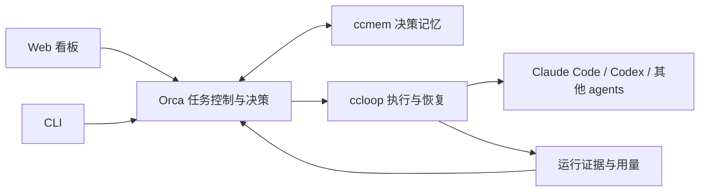

# Orca 任务控制与决策记忆：架构设计（待书面审阅）

归属：Codex task `01a0b792-9ebb-79d0-ba91-604825a9f974`，2026-09-19。
观测基点：Orca `fd4d82c`、ccloop `befb91f`、ccmem `d3978b1`。
本文记录本次人的要求、已认可的方向和具体设计建议；不把建议冒充逐项人裁。
人已同意聊天中的六步方向并要求继续。本文是架构层 spec；各实施切片仍需各自计划。

## 1. 意图、范围与人的要求

让人主要在 Web UI 中安排、启动、停止一组 agents 的工作，随时看懂并纠正 Orca 的决策。
Orca 控制 ccloop；ccloop 负责具体 agents 的执行适配。
ccmem 要实际参与 Orca 的决策，而不只是设计文档里的未来依赖。

人的明确要求：

- Web UI > CLI；两者调用相同的控制能力。
- agent 适配优先级：Claude Code > Codex CLI > OpenCode > oh-my-pi > pi。
- 支持任务、任务组、goal、自动拆分、顺序和并行关系、启动和停止。
- 控制 token、时间、轮数；在上限前写好交接，避免截断后无法续接。
- 每个任务有独立 handoff；任务完成后归纳到任务组 handoff。
- 重点参考 Hermes Kanban，用于分析 Orca 代人作出的决策和及时纠正。
- 2026-09-19 补充：Claude Code 本周额度耗尽，到 **2026-09-22 09:00 Asia/Shanghai** 后才恢复；可考虑紧急接入 Codex CLI 测试。

首次完整验收：人在 Web 创建 goal，形成包含并行与顺序关系的任务图，经 ccloop 执行，
在额度耗尽前保存可恢复交接，并让一次人工纠正被后续相关决策实际引用。
任务全部完成还必须核验组 goal，不能从任务数量直接推断目标达成。

## 2. 现状与差距

| 已有代码 | 可复用能力 | 尚缺 |
|---|---|---|
| `src/scheduler/planFile.ts`、`graph.ts`、`pool.ts` | 任务 id、dependsOn、环检测、写集冲突排序、并发 | 可持久修改的任务组、运行中变更、组预算 |
| `src/scheduler/ccloopRunner.ts` | 经子进程运行 ccloop、读取 terminal status、收产物 | 通用执行能力声明、交接请求与连续用量观测 |
| `src/chain/**` | 串行开发会话续接、限额、停链、检查点 | 当前专属 Orca checkout 与 Claude Code，不能直接代表多任务产品 |
| `src/checkpoint/**`、`src/level/**` | 检查点、resume、Claude Code 上下文水位 | 按 task/run 精确恢复、组汇总、其他 runtime 水位 |
| `src/panel/**`、`web/src/**` | 决策列表/详情、纠正记录、链控制 | 任务看板与调度控制；纠正尚未接入 ccmem |
| ccloop `src/runtime/types.ts` | RuntimeAdapter 的 plan/execute/verify | Codex adapter；能力及交接协议需要增补 |
| ccloop `src/contract/schema.ts` | tokenBudget、maxAttempts、总时长、单次超时 | 组预算分配、在上限前完成交接的保证 |

本机 `codex --version` 返回 `codex-cli 0.155.1`；`codex exec --help` 显示 JSONL 事件、
output schema、ephemeral、sandbox 与 exec resume。这里只验证了本地 CLI 表面，
尚未验证模型调用、事件字段、usage 的实时性或恢复行为。

参考源码：Hermes `hermes_cli/kanban_decompose.py` 中保留父任务、生成依赖图、
子任务完成后重新唤醒父任务评估目标；`plugins/kanban/dashboard/plugin_api.py` 提供任务、依赖、
审查、执行终止、完整交接详情。OpenClaw `docs/web/control-ui.md` 展示控制端与后台服务分离的方式。
借鉴操作流程，不复制它们的 agent 执行器或数据库实现。

## 3. 方案与边界

采用方案 A：在现有 Orca 调度与决策台账上增加任务控制服务，通过 ccloop 执行。

| 方案 | 优点 | 代价与结论 |
|---|---|---|
| A：复用 scheduler，增加持久任务控制 | 保留 ccloop 边界、现有验证和决策记录 | 需把单次 round 的状态改为可恢复任务运行；推荐 |
| B：把 chain 扩为多 agent 多任务执行器 | 可直接沿用当前 Claude 启动代码 | Orca 重复 ccloop 的执行职责，与人要求冲突；不采用 |
| C：嵌入 Hermes Kanban 后端 | 获得现成工作流 | 引入第二套调度、执行、存储语义；不采用 |



Orca 负责 goal、任务图、授权范围、预算分配、排队、决策及纠正；确定性调度由代码完成。
ccloop 负责 agent 参数、事件解析、进程生命周期、阶段结果与执行恢复。
CLI 与 Web 调用同一个应用层；浏览器连接断开不终止后台任务。
ccmem 存储可检索的项目背景、人的偏好、决策纠正，不拥有任务状态或剩余额度。

现有 chain 保留为开发会话续接能力，先修其登记缺陷，不给它增加 Codex 启动器。
产品任务的 Codex 路径从 ccloop 接入。两条路径在迁移前分别命名、分别验收。

## 4. 任务模型与状态

四层身份：projectKey → groupId → taskId → runId。taskId 在续接中稳定，每次执行生成新 runId。
group 有 goal、successConditions、约束、预算、任务图版本和汇总检查点。
task 有目标、验收、dependsOn、写集、执行配置、预算分配和最新有效检查点引用。
run 记录实际 adapter/model、配置版本、输入检查点、用量原始证据、产物与终态。

任务状态建议：draft、ready、running、handoff_pending、paused、blocked、review、done、failed、cancelled。
依赖未满足保持待运行并展示原因；需要人的输入才标 blocked。不得靠反复重启解除同一个阻塞。
run 的终态映射保留 ccloop 原值；任务业务状态不直接替换 ccloop 的执行状态。

所有变更带 expectedRevision 和幂等 commandId。过期页面的修改返回冲突并展示最新状态。
任务领取和预算预留必须原子完成，监督进程有租约和代次；旧代次不能提交新状态或启动新执行。
保存目标工作区与产物引用，恢复前核对实际运行者和 ccloop 状态，不能只信 UI 的 running 标签。

第一阶段采用单个本地控制服务作为写入者；任务元数据存 SQLite，事务覆盖任务领取、预算和事件。
控制状态存放在显式配置的 Orca stateDir，默认仓库内被忽略的 `.orca/control/`。
源码提交不承载高频控制状态；可迁移的 checkpoint/handoff 与证据引用单独导出。
这是任务控制的新存储需求，不等于重开既有 E4 决策索引数据库优化。
所有新增全局写入必须另行登记；测试 stateDir 一律改道，继续保证真实 `~/.orca` 不被创建。

## 5. goal 拆分、依赖与运行中纠正

自动拆分输出有版本的提案：子任务、验收、依赖、建议执行配置、预算分配、理由。
代码检查重复 id、环、无效依赖、预算超配、写集冲突；模型不决定可并发执行的最终结果。
人可以编辑提案，也可为任务组预先授权范围内自动拆分。默认首次图在启动前可审阅。

运行中新增任务允许，但影响已运行任务的目标、依赖、预算改动先形成新版本。
对被影响的运行发交接请求；确认旧运行停止后再采用新版本，不原地替换工人正在执行的契约。
人的纠正先制止相关旧决策继续被派发，再按依赖影响范围标记下游需重新核验。
已经写出的代码不会因点击“纠正”自动消失；撤销、补救是有证据与授权范围的新任务。

## 6. 预算、交接与停止

区分以下量，显示来源、观测时间、未知状态，不互相换算：

- 累计 token 消耗：跨阶段与续接累计，cached input 是其中的子项，不能重复相加。
- 单会话上下文占用：用于判断是否必须换会话，与累计消耗不是同一数。
- 时间：组总运行预算、任务预算、单次执行超时；暂停时间是否计入必须在配置中明确。
  本方案以执行中的累计时长计预算；另可设绝对截止时间，不能用前者冒充后者。
- 轮数：ccloop attempt、agent turn、会话数分别命名；首版产品“轮数”指 ccloop attempt，
  会话数单独限制，agent turn 仅在 adapter 支持可靠计数时提供。
- 成本：只显示 provider 真实报告；拿不到时为 unknown，不由 token 猜美元。

组为每个活动任务预留预算，必须满足 used + reserved <= limit；拆分、重试和续接均不得重置已用量。
每份分配包含工作额度与交接预留。停止派新任务后，已运行任务仍可使用其已预留交接额度。
达到工作额度、上下文水位或最后一轮的交接窗口时转 handoff_pending，停止接新工作，写检查点并退出。
新运行只消费剩余额度；增加预算是人的显式修改，不由模型自行抬限。

adapter 能力必须显式声明：usage 是实时、阶段末或不可用；是否能请求交接、恢复、强制终止、
读取上下文占用。未知用量不能当零。仅阶段末 usage 的实现无法承诺 token 硬上限，
UI 必须展示这一限制；严格预算模式在能力不够时拒绝启动，不静默降级。
初版 Codex 只在事件实测之后声明能力，不从 exec --help 推断实时水位。

停止分三种动作：暂停派发（在飞任务继续）、交接后停止（默认）、立即终止。
立即终止可能只能保留最近有效检查点与机械采集的现场，不能显示为“完整交接成功”。
交接超时同样保存 partial 状态与原因，再由 ccloop 回收进程组。停止组时先锁存组停止状态，
阻止所有新领取，再逐个通知活动任务；重新启动必须显式清除停止意图。

## 7. 每任务 handoff 与 D3

每任务检查点是唯一恢复真相源，包含 group/task/run 身份、目标版本、已完成项、未完成项、
未决决策、awaitingHuman、预算账本引用、工作区/产物版本、验证命令和原始日志引用。
文件按 task 隔离且保留版本，不用“整个仓库最新一份”来猜本次任务该读哪份。

建议导出布局（均在显式 state/export root 下）：

```text
groups/<groupId>/checkpoint.json
groups/<groupId>/handoff.md
groups/<groupId>/tasks/<taskId>/checkpoints/<runId>.json
groups/<groupId>/tasks/<taskId>/handoff.md
```

Markdown 是从已持久化检查点生成的交接文档，不维护另一套状态；保留具体证据与恢复命令，
生成失败不使 JSON 检查点失效。用临时文件与原子替换发布 latest 引用。
组 handoff 在任务完成时归纳成果、依赖影响和未决事项，并链接任务原始检查点。
组暂停或耗尽时也更新汇总，包含未完成任务；不能等全组完成才第一次写组交接。

恢复验证身份、目标版本、产物可达性与预算；工作区有未提交变化时保存现场引用并标注，
不能把“必须干净才可写当前开发检查点”的旧约束直接照搬成产品恢复前提。
不能读取的检查点不回退到任意最新会话。历史开发 handoff 保留，D3 迁移不删除原记录。

## 8. ccmem 的决策闭环

写入记忆的单位是有出处的决策样本：原选择、理由、证据、备选、人改成什么、原因、
projectKey、适用范围及 decision/correction id。当前台账与 correction 原文仍是审计证据。
通过 ccmem 的公开 CLI/服务接口接入，不 vendor 算法，不直接写人的 SQLite。

决策前按项目与任务检索，决策记录写出引用的 memory id 和来源；必要约束来自任务契约与人的
当前指令，不允许旧偏好覆盖当前明确要求。人的纠正即时进入本任务组的有效约束，
持久记忆写入异步重试且有稳定幂等键，不能因为 ccmem 暂时失败就丢失纠正或重复写样本。
UI 展示“已记录 / 已同步记忆 / 后续已引用”，三者不可合成一个成功提示。

ccmem 不可用时显式标记 memory-unavailable。一般任务可在已知契约下继续；依赖必需记忆约束的
决策阻塞。具体公开接口与去重能力在记忆切片开工时核对，不声称当前已支持倾向 track。
验收采用改道的临时数据：记录纠正 → 同步 → 新决策检索到该样本 → 产出的选择与理由引用它。
同时测跨项目隔离、重复投递、过期偏好与当前指令冲突、记忆不可用。

## 9. Web 的首版操作面

任务组页：goal、验收、任务图、总预算、运行配置、开始/暂停派发/交接后停止/立即终止。
看板：按任务状态分列，卡片展示负责人配置、依赖阻塞、剩余额度、交接状态与待人决策数。
任务详情：目标版本、执行时间线、决策及证据、人的纠正、handoff、运行原始日志。
每项控制必须经同一个应用服务执行；前端禁用按钮只是提示，后端仍校验权限、版本、状态。
UI 不通过修改数据库字段假装执行终止完成，必须等待 ccloop 的实际终止证据。
首版保持单人本地服务；远程入口沿用并复核既有身份/Host/token 规则，不顺便引入多用户系统。

## 10. Codex 紧急切片与测试边界

紧急改变的是实施顺序，不改变长期适配优先级。先做 ccloop Codex adapter 的窄切片：

1. 保持 RuntimeAdapter 的 plan/execute/verify，新增具名 codex 类型及配置；
   原 `--adapter claude` 行为保留，不用假名把 Codex 塞进 Claude 配置。
2. 在 ccloop 内构造 exec 参数、处理 JSONL、结构化最终结果、阶段 usage、异常与取消。
   Orca 只传适配器名和配置引用，不解析 Codex 事件。
3. 与现有恢复逻辑接缝核对：先支持新的 phase 调用；原生 exec resume 不是跨 agent handoff，
   不宣称直接消费 Claude session id。跨 runtime 恢复使用任务检查点及产物。
4. 先 fake executable 覆盖参数、cwd、stdin、坏 JSON、缺终态、错误事件、重复 usage、
   已中止 signal、超时、残留进程、部分产物和 schema 不匹配；失败时绝不回退真实 PATH。
5. 再运行一次明确的小型 Codex 真机验收：隔离工作区、有限任务、固定 model/config、
   有界超时、日志与 usage 留证。quota/auth 错误按名报告，不切到 Claude，不循环重试。

本机 Codex 是否有可用额度、真实事件的 usage 语义仍待这次验收；CLI 安装不等于服务可用。
当前 Claude Code 的 `.claude/settings.json` 闸门不自动保护 Codex。
Codex 的执行 sandbox/审批、目标仓库规则和禁止操作的边界必须单独验证；
在此之前，真机验收只允许隔离的低风险任务，不运行生产工作区的自治链。
不得启用 bypass sandbox / hook trust / ignore rules 以让验收强行通过。

Claude 真机验收仍列 awaitingHuman：9 月 22 日 09:00 后也不自动开跑，
仍需人选择 `.orca/chain.json` 的 model 并点头，先实测首次读数 F，副本 T1 > F。
离线 fake Claude 测试可照常执行，报告明确标为离线测试。

## 11. 分阶段交付及可执行判据的责任

| 顺序 | 切片 | 交付边界 |
|---|---|---|
| 0 | D-launch E7 与 settle 缺陷 | 独立修复、删除变异、现有回归；不依赖 Claude 额度 |
| 1 | ccloop Codex adapter | 首个可运行真实 agent 的替代测试路径；单独 spec/计划 |
| 2 | Orca 任务组控制 + Web 最小流程 | 手工任务图、持久状态、ccloop 派发、停止、证据显示 |
| 3 | D3 与预算交接 | 每任务/组 handoff、预算继承、崩溃恢复、能力不足时按名拒绝 |
| 4 | 自动拆分与 ccmem 闭环 | 图提案、人纠正、记忆同步/引用、组 goal 复核 |
| 5 | Claude 真机验收与后续 agents | 额度及授权满足后测 Claude；按既定顺序扩展 |

切片 2 的服务接口预留切片 3 的 budget/checkpoint/capabilities 字段；
未实现能力的控制项明确不可用，不把 fake 实现包装成产品完成。
每切片计划必须给出能以退出码判定的实际命令、fixtures、变异落点、进程/数据清理证据。
本架构文档不虚构尚不存在的测试命令。
总体验收必须覆盖：相同任务不能重复领取、停组后无新任务启动、并行预算不超配、
坏/缺 usage 不变零、任务续接不重置组预算、交接未落盘不显示可恢复、
记忆纠正实质影响后续选择、当前指令覆盖旧偏好、目标未满足不得判组完成。

## 12. 旧设计的更正与尚待审阅的选择

本文通过后，显式替代以下未来产品方向；历史事实保留：

- D3 旧表述“检查点本身就是 handoff，不再生成文档”改为检查点为真相源，
  按任务生成 handoff 文档并归纳到组；不恢复一份所有任务共写的大文档。
- Web 从决策阅读和链入口升级为主要任务控制端；“只记、不闭环”不再是产品终点。
- chain 的 Claude 专用开发链不能充当通用任务执行协议；具体 agent 适配归 ccloop。

建议待书面审阅的具体选择：SQLite 单写服务、默认仓库内 stateDir、首版轮数指 attempts、
执行累计时长与绝对截止时间分开、token 消耗与上下文占用分开、严格额度模式拒绝不支持的 adapter。
若这些选择获认可，再写实施计划；不把“同意总体方向”扩大为对尚未存在的详细计划的批准。
